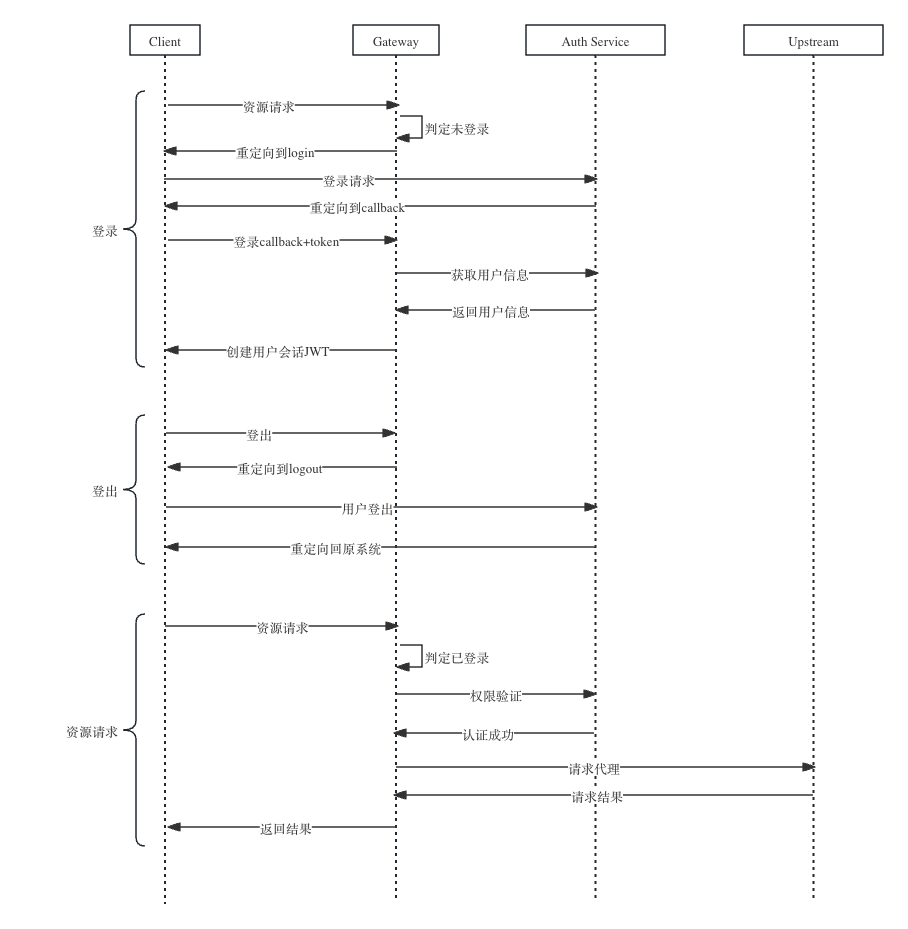

## 需求描述
* 微服务系统中有多个子系统
* 每个子系统有一个前端域名
* 后端也有多个域名，前端访问后端为跨域访问
* 使用网关作为统一入口，要求登录与认证对前端后端无感知
* 后端使用统一的ContextHolder处理用户会话

## 时序图


## 网关的主要逻辑
```lua

-- callback处理逻辑
if request_uri == conf.callback_uri then
    -- 根据code换取用户信息
    user_info = changeToken(arg_code)
    -- 写session
    save_session(user_info)
    -- 重定向到origin_uri
    return redirect_to_origin_uri()
end

-- 跳登录
if is_need_login() then
    return redirect_to_login()
end

-- 登出
if request_uri == conf.logout_uri then
    delete_session()
    return redirect_to_home()
end

-- 权限认证
if not is_permitted() then
    return 403
end

```


## 一些tips

前端请求后端接口如果跨域的话需要带上cookie，但浏览器的同源策略有限制，可以这样解决:
* 保证前后端有共同的上级域名，例如：
  * 前端: front.example.com
  * 后端: backend.example.com
* 登录完成之后设计cookie的时候这样设置:
  * SameSite=None
  * Path=/
  * Seucre
  * HttpOnly
  * Domain=.example.com
* 后端域名设置跨域
  * Access-Control-Allow-Credentials: true
  * Access-Control-Allow-Origin: https://front.example.com
  * 
* 前端在请求时设置`withCredentials = true`

可以按一级域名对不同的应用进行分组，这样每个应用之间可以共享用户会话。例如，假设有两个应用：
* 应用一:
  * 前端: front.app1.com
  * 后端: backend.app1.com
* 应用二:
  * 前端: front.app2.com
  * 后端: backend.app2.com
