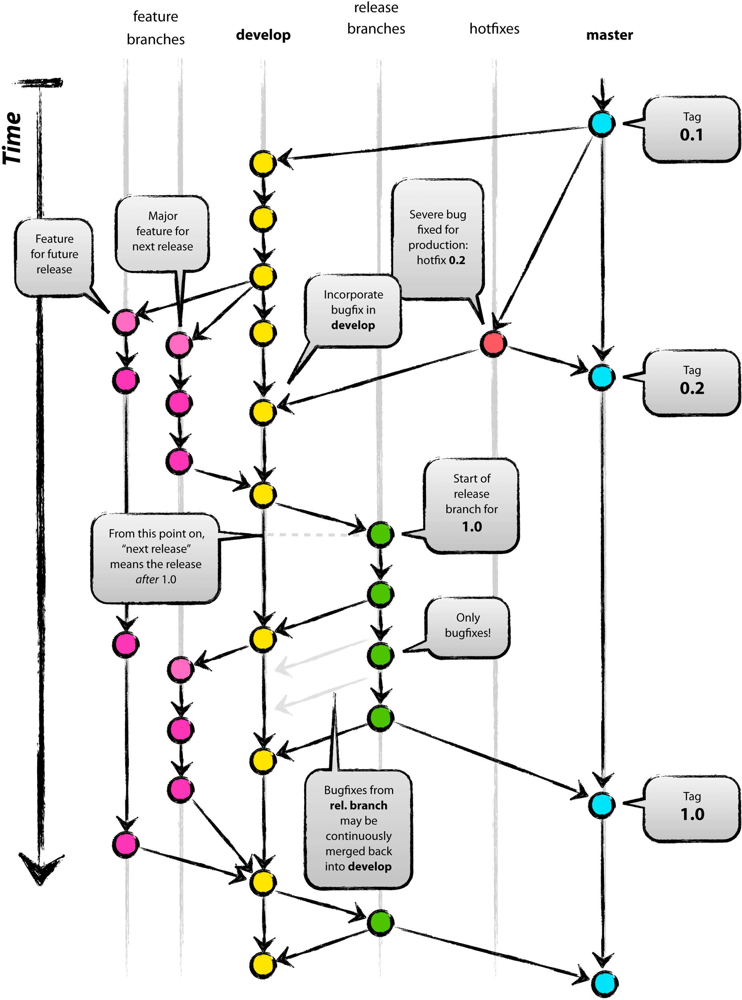
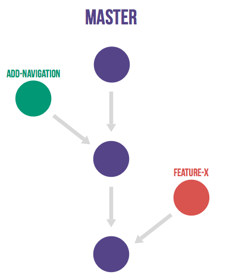
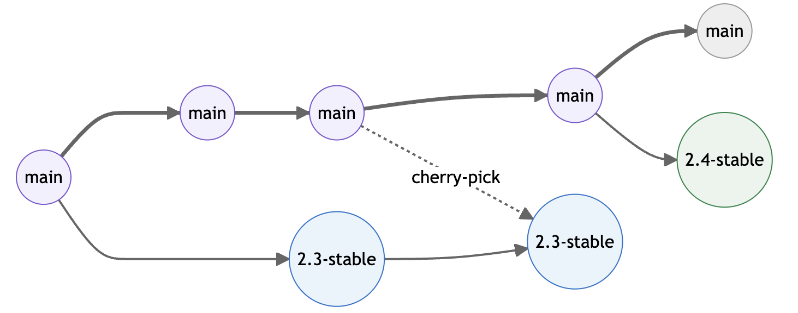
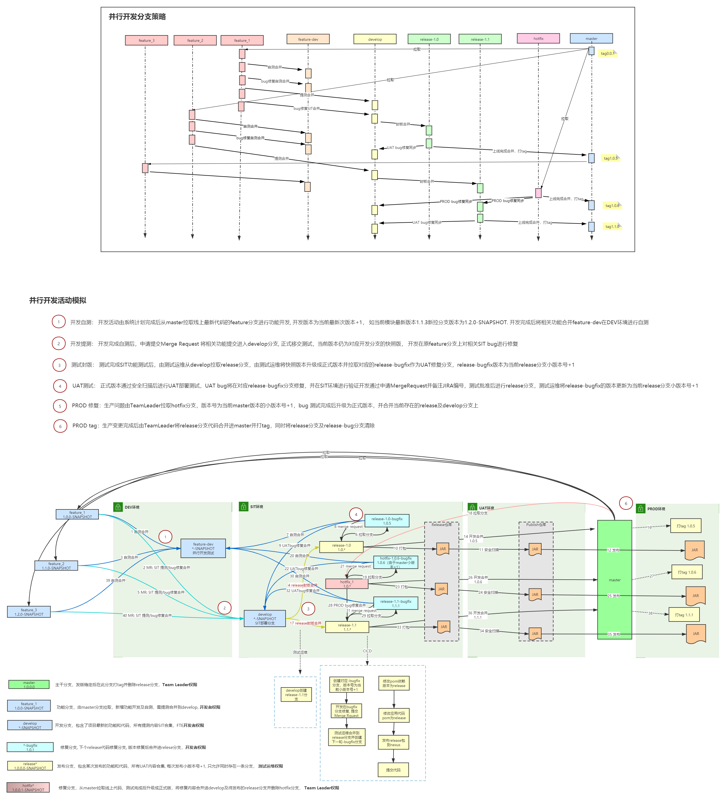
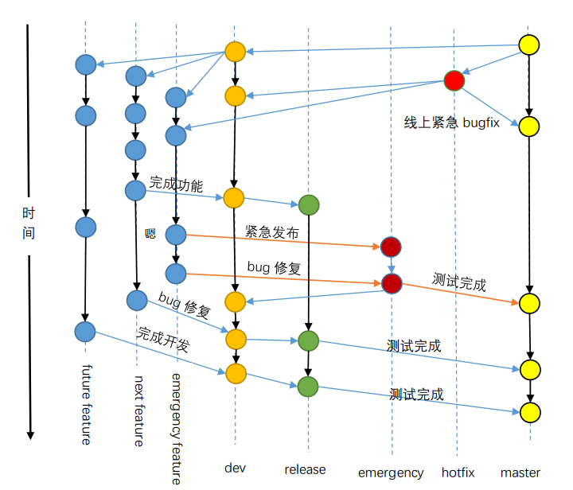
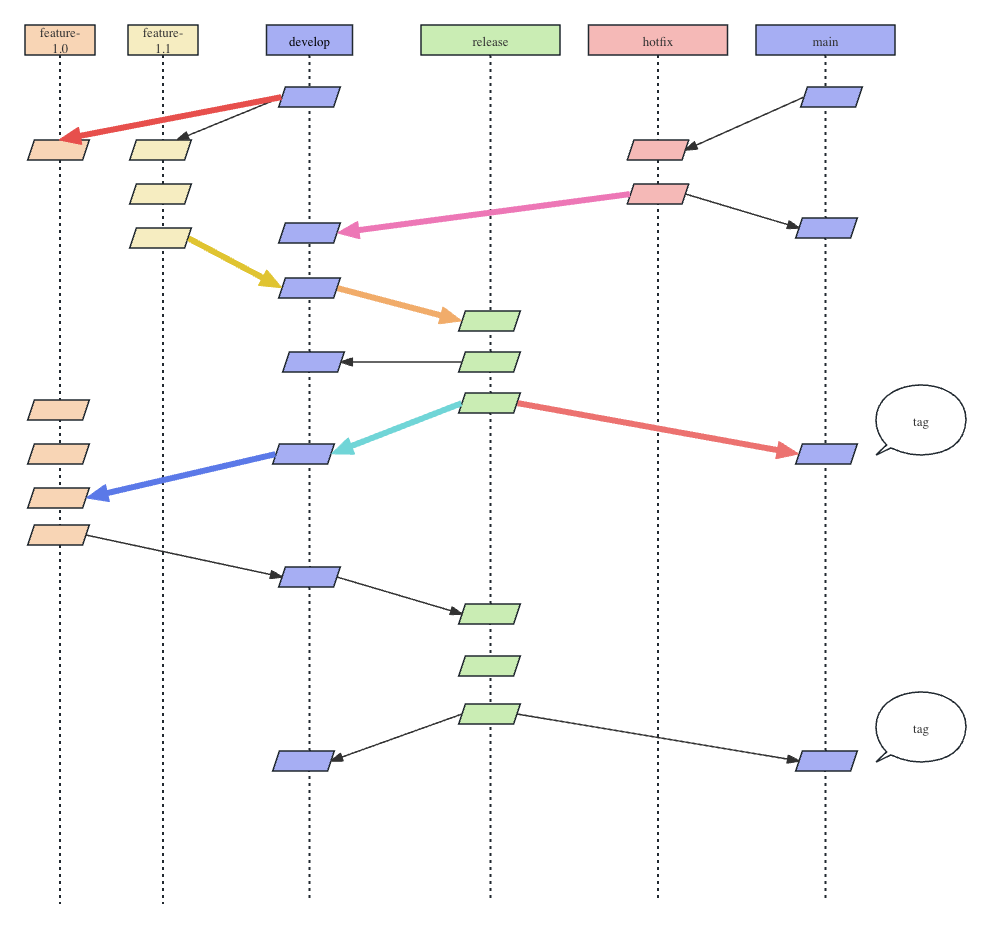

## 本文介绍业内常见的三种git分支管理策略
Git Flow, Github Flow, Gitlab Flow
## Git Flow

###  特点
* 两条主分支: develop, master
* 多条临时分支: feature, release-xxx, hotfix等
### Tips
* feature合并到develop之后同时创建release-xx分支
* 在release-xx分支上进行bug修复，修复完成封版时同时合并到develop和master
* release-xx分支用于dev和test环境部署，master分支用于pre,producte分支部署

### 总结
* 综合考虑了feature和hotfix
* 每个feature独立release分支，适合并行开发

## GitHub Flow

### 特点
* 一条主分支master
* 不分区feature与hotfix
### Tips
* 依赖代码审查
### 总结
* 简单
* 合适开源软件
* 合适持续发布
* 对贡献者素质要求高

## Gitlab Flow
[Gitlab Flow介绍](https://docs.gitlab.cn/jh/topics/gitlab_flow.html)

## 特点
* 一条主分支master
* 可以存在多条环境分支
* 可以存在多条发布分支
* 适合自动化与CI/CD
## Tips
* 基于环境的分支管理策略
  * 每个环境对应一个分支，遵循upstream first原则，代码不会产生冲突，由CI/CD自动完成合并。
  * 没有hotfix流程
  * 发布分支没有隔离，并行开发不友好
* 基于版本的分支管理策略
  * 每个版本对应一个分支，与git flow相似，对并行开发友好
  * hotfix可以基于版本分支创建，修复完成之后再合并到对应版本分支与master分支
* 与github flow类似，master分支需要保证是一个可发布的版本，feature分支在合并到master之前最好经过了自动化测试

## 总结
* 一条主分支，主分支要保证可部署

## 场景与解决方案

### 多feature并行开发
|策略|方案|
|--|--|
|git flow|- 从develop拉多条feature分支  - 每个feature开发完成之后合并到develop并同时创建release分支  - release分支上进行测试与bug修复，完成后合并到develop和master|
|gitlab flow(基于版本)|- 从master拉feature分支  - 开发完成之后经过自动化测试流程，最后合并到master  - 从master拉release分支进行后续的测试与生产发布  - 在release分支上修复问题，合并回master分支|

### hotfix
|策略|方案|
|--|--|
|git flow|- 从master拉hotfix分支  - 修复问题并合并回master分支进行生产环境验证  - 最后合并回develop分支|
|gitlab flow(基于版本)|- 从release上拉取hotfix，修复完成之后合并到release分支和master分支|

## 案例

## CSND分支管理策略建议
建议git flow
* 可操作性强，有明确的操作方法
* 并行开发支持性好
* hotfix支持性好

### 分支命名规范
* 需求开发分支: feature-*
* 主线开发分支: develop
* 测试分支: release-[0-9].[0-9]-yyyyMMdd
* 发布分支: main

### 开发流程

### 环境与分支

｜环境|分支|
|--|--|
|dev|develop,feature|
|test|release-xx|
|uat|release-xx|
|prod|main|

### 分支合并PR
* feature -> develop
* release -> develop
* release -> main